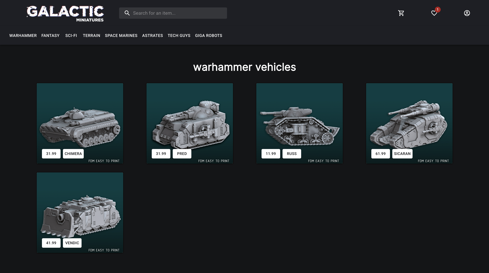
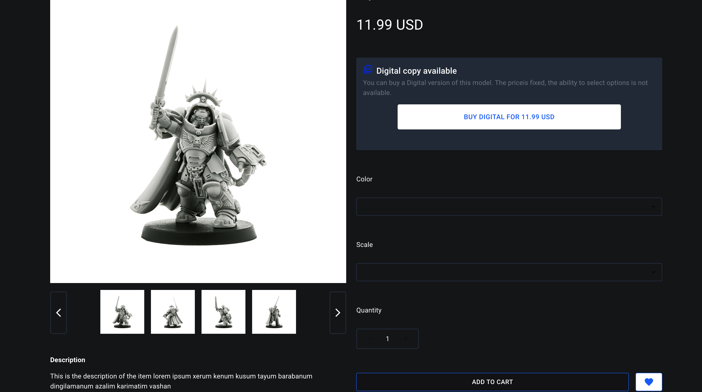
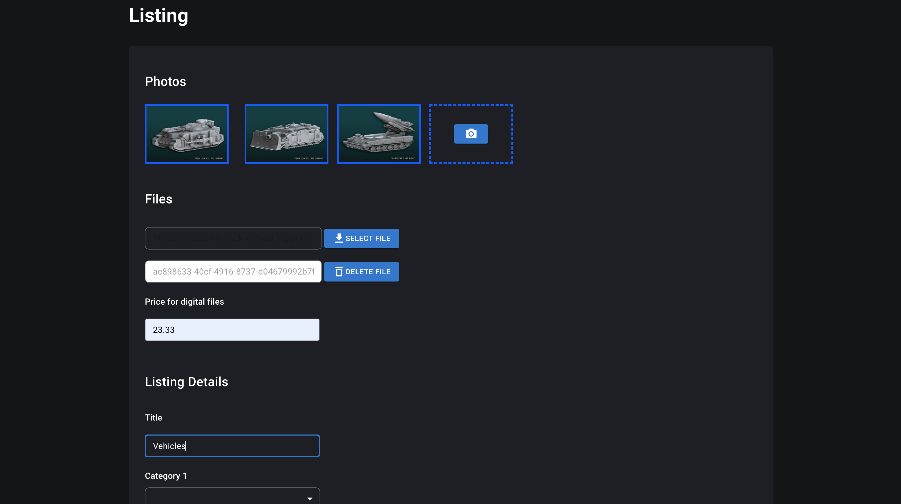
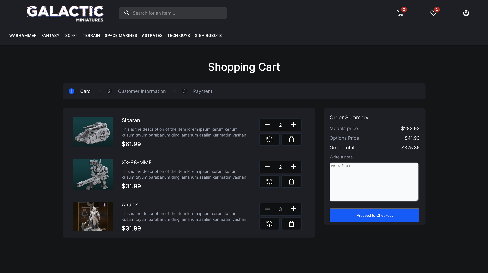
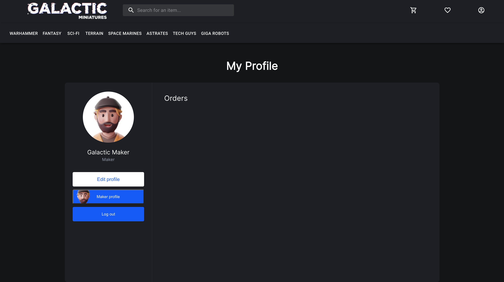

# Galactic Miniatures

Online store for selling both digital and physical copies of 3D art.
---
## Description

The project was done under the tight deadline, as the customer had to show an MVP to his potential partners in 10 days. The idea of a project is to gather all 3D art miniatures enthusiasts in one and only platform where creators(designers) of 3D art would have an opportunity to sell the digital copies of their art to those who are interested to buy them. The buyers then have a choice to order a printed(physical) copy of that model with any registered maker who prints the model and ships it to buyer. There is also an alternative to buy a ready-made physical copy of certain miniatures right away.

---
### How to install and run
- `cd server` to navigate to `server` directory
- `npm install` to install all necessary dependencies
- `npx sequelize db:create` to create a database
- `npx run mig` to perform all neccessary migrations
- `npx run seed` to populate the database
- `npm start` to run the server locally on your computer
- `cd front` to navigate to `front` directory
- `npm install` to install all necessary dependencies
- `npm start` to run the project locally on your computer.
---

##### Main Page

    

##### Sorted by category

    

##### Modal page

    

##### Add new listing form page

    

##### Shopping cart page

    

##### Maker profile page

    

